# Sitecore Hackathon 2022

- MUST READ: **[Submission requirements](SUBMISSION_REQUIREMENTS.md)**
- [Entry form template](ENTRYFORM.md)
- [Starter kit instructions](STARTERKIT_INSTRUCTIONS.md)
  

## Team name
Send Pizza and Coffee 🍕☕

## Category
Best Addition to the Sitecore MVP Site

## Description

One of the coolest rewards after becoming a Sitecore MVP has always been the Sitecore Swag we receive. However, due to the pandemic and changes from year to year, the delivery process can be a little confusing. We decided to make a "Sitecore MVP Swag tracker" page with some modules where the user could track the delivery status of their care package. 

## Video

## Pre-requisites and Dependencies

The page only requires a vanilla install of Sitecore 10.2 and deployment of the VS solution and synchronization of items. In addition, it requires the build and deployment of Front End assets to the site folder.

## Installation instructions

- Install a vanilla instance of Sitecore 10.2 under the site: https://sendpizza.dev/
- Build and deploy the Visual Studio Solution.
- Sync all TDS projects.
- Build the front end solution assets by running the following 2 commands in the folder **\src\FrontEnd** 
purpose  - npm install
  - npm run prod
- Manually copy the dist folder from the folder from the step above to the site webroot:
  - \src\FrontEnd\dist => \inetpub\wwwroot\sendpizza.dev\dist
- Alternatively, you can edit the file **CopyFEEAssets.bat** with your local paths and run as admin to automatically copy the assets to the right place.

### Configuration
If you have a Google Maps API key available, you could add it to the following file **.env.example** and rename it as **.env**. Otherwise, you can leave it empty and you will get the "For development purposes only" over the map.

## Usage instructions
## Intro
The value of real-time systems came into focus in 2020 as companies responded to the disruptions due to COVID-19. Nowadays, people want to have information at hand efficiently, this creates confidence in technological users, the information must be in real time, the actual generation wants the information, right now. 

[Read more](https://www.rtinsights.com/real-time-technology-trends-that-will-drive-2021-innovation/)

We developed a page with a prof of concept module where a user could track the status of the delivery of their care package. This module will display the status of the delivery in real time from an external external push service which could come from a mobile app from the delivery service.

## Features

### **Header**
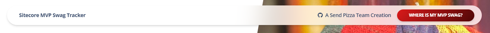

The page contains a small header module where the user can click a CTA to scroll to our main tracking module.

### **Masthead**
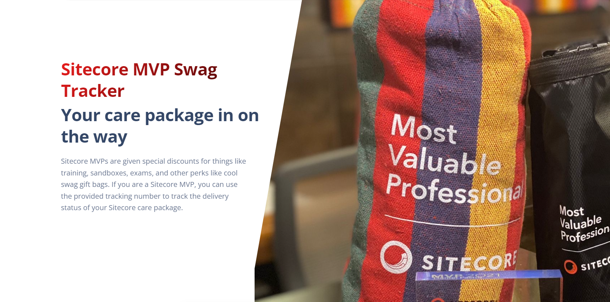

We added a basic masthead/banner module to offer basic information to the user. Data for this module is managed in the page context item:
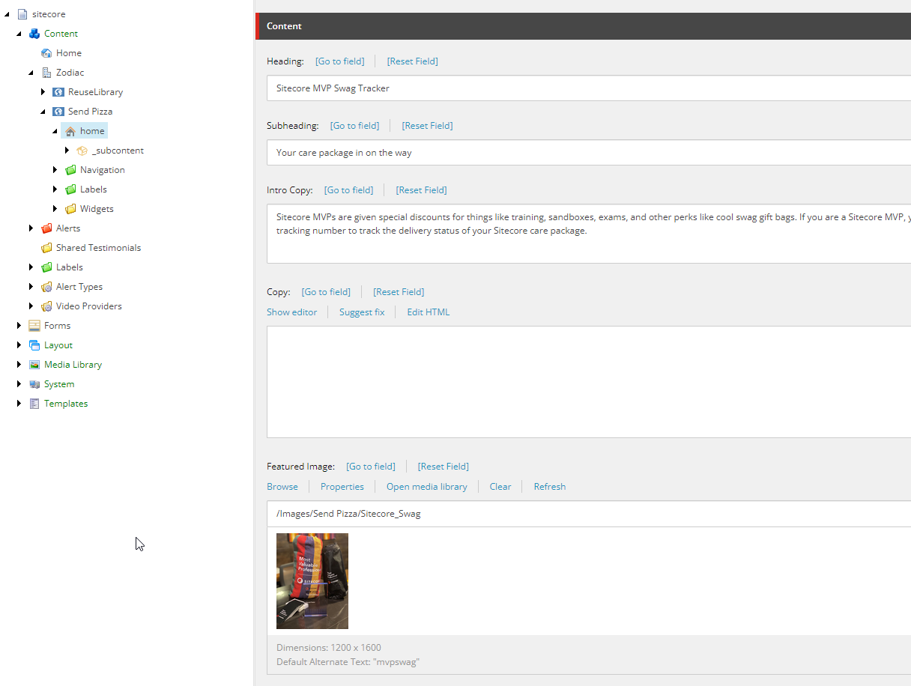

### **Tracking Module**
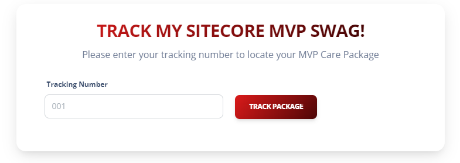

HTML 5 Websockets provides for a full duplex bidirectional channel for communications over the web through a Transport layer socket. As described in the websocket protocol RFC 6455.

Building applications like location based intelligence, Geo fencing, track and trace becomes all the more simplified with HTML5 Websockets allowing developers to share location updates in real time and create amazing work flows with the real time data.

With that in mind we used [Pusher.com](https://pusher.com/?utm_source=google_ads&utm_medium=homepage&utm_campaign=comp_brand_search&gclid=CjwKCAiAsYyRBhACEiwAkJFKooePiRSR-4pF8YL97zmlWVcxuTY5GS522Pb6ojcYwHZB2p6ZDOQNXBoCmTEQAvD_BwE) as a Websockets library because is it easy to use and implement with the short time for this hackathon. It is useful to demo our purposes.
* Cloud App used to push data into our module. For our proof of concept, we are using a Laravel App Running on a private server to simulate real world data:
  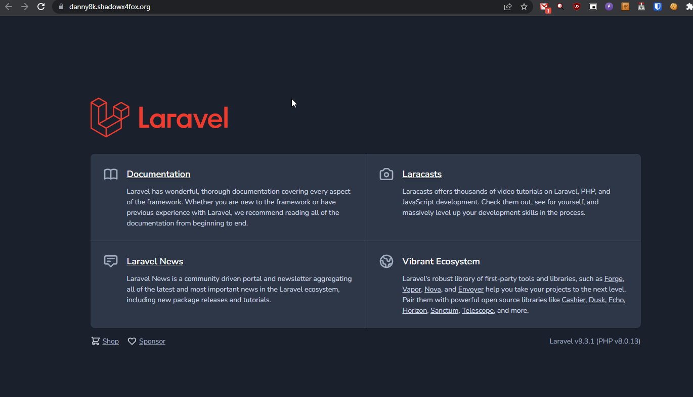
* Sitecore tracking module receiving data to track delivery location:
  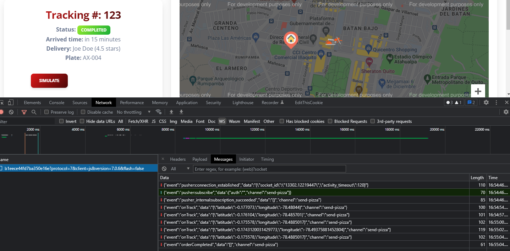
  

Our workflow is easy to understand. Websockets provides a channel to broadcast to the users the information about their package tracking with the following events:

* On Track: Send the deliver man location in real-time, the idea is that each delivery man have a mobile application that sends the geo location.
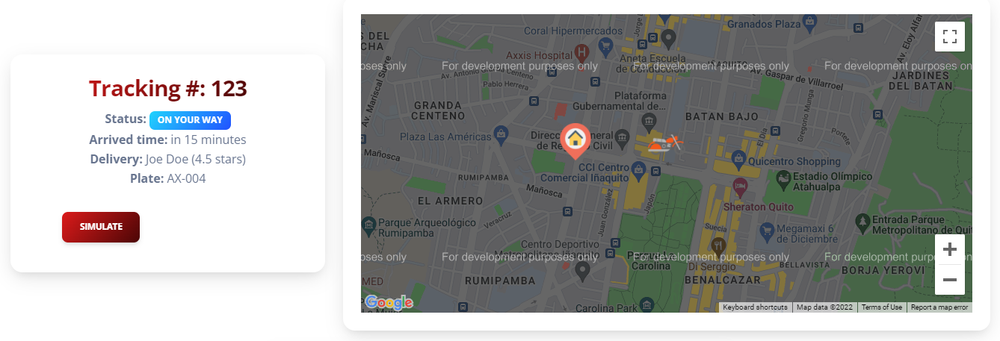
* On Order Completed: This event notify to the website's user that the order is completed and delivered at the door.
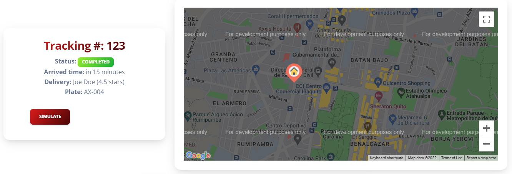

This workflow with more work will be more complex and fits the business needs but for the demo, I'm very proud of what we archived.

**Future improvements:**

* On Cancelled Order: You will be notified if your package could not be able delivery.
* On Flight Status Changed: You could track the status of your package if it is on way in flight, or if the package is in customs.

As you can see we can add more rules and events in your system to make it better.

Data such as labels, headings, description for this module is fully managed within a datasource in Sitecore under the /_subcontent/ folder.
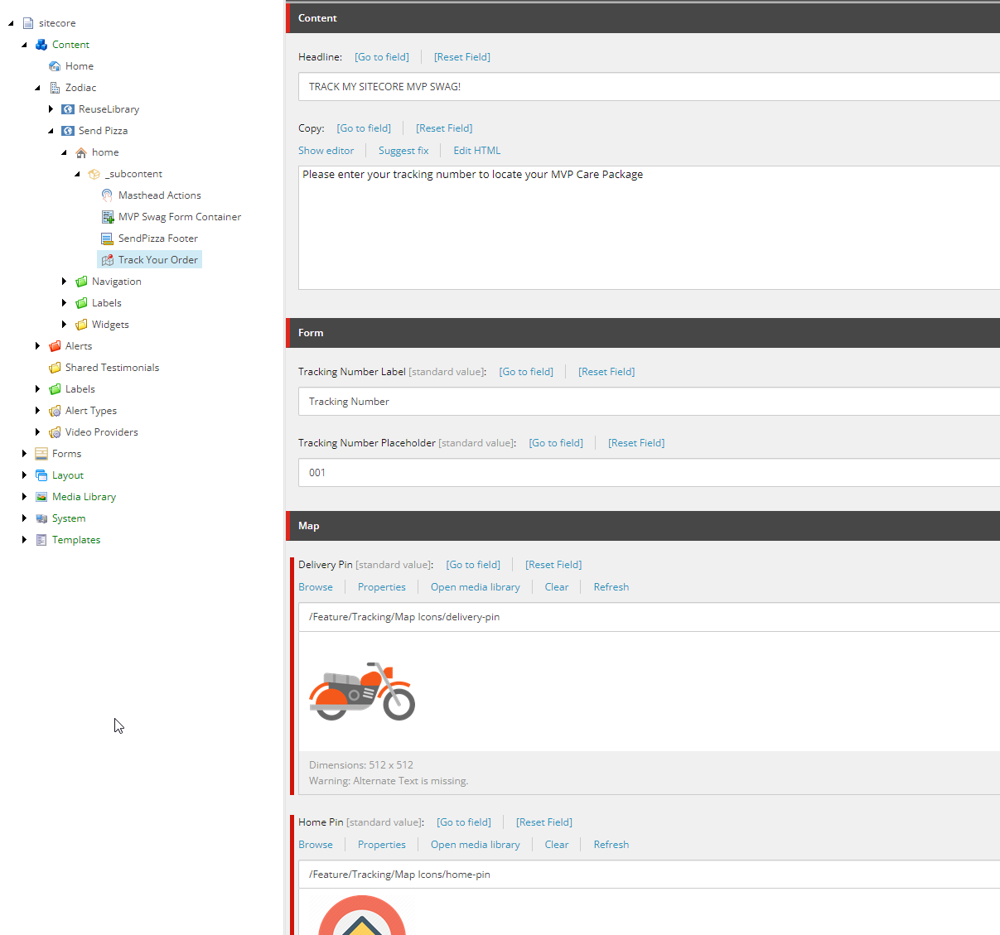

### **Contact Form**
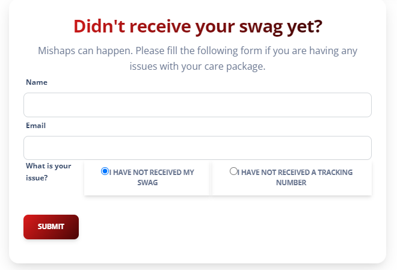

In case the user is facing any issues with his delivery, we added a Sitecore Forms module to report and save his data into Sitecore and we attempted to style the form as close as possible to the theme of the page.
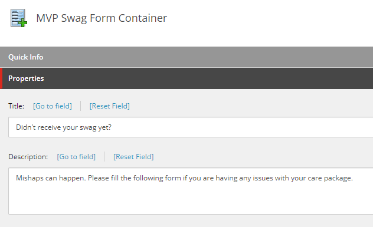
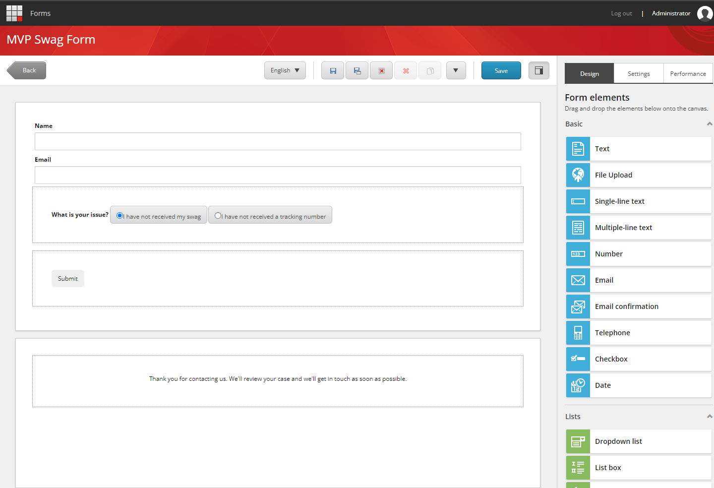

### **Footer**
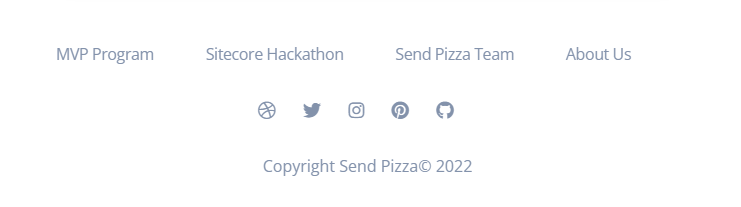

Finally, we added basic footer module with relevant links and links to social media. The module and its links are fully content managed within Sitecore under a /_subcontent/ datasource. 
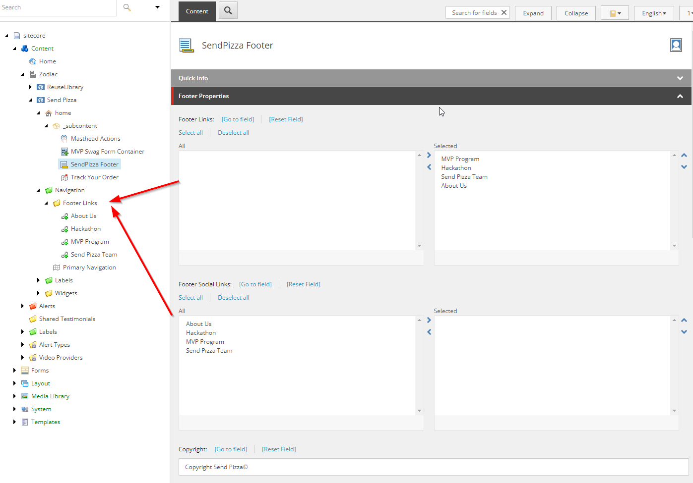

